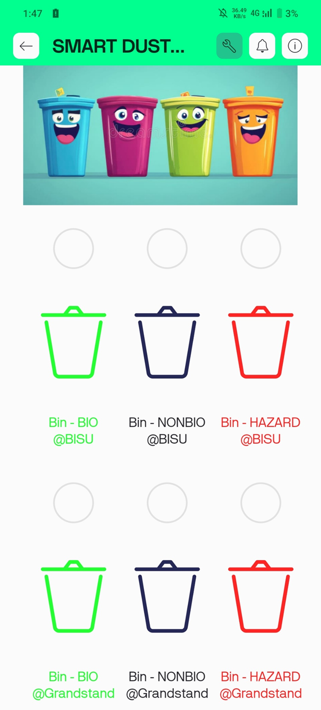
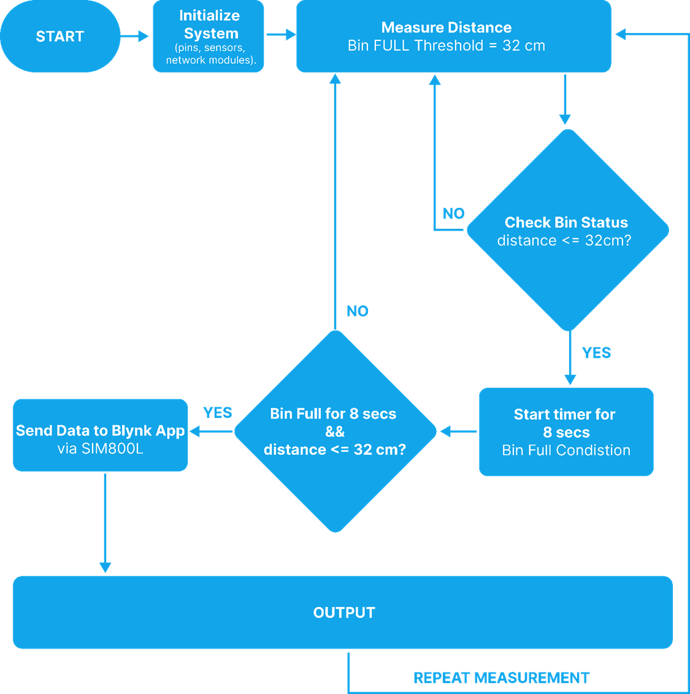
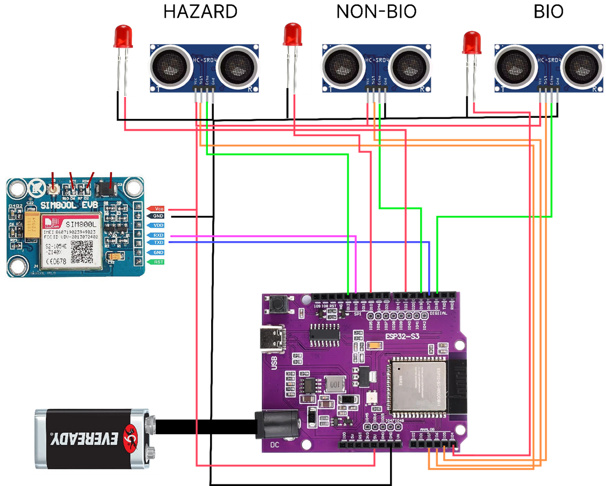
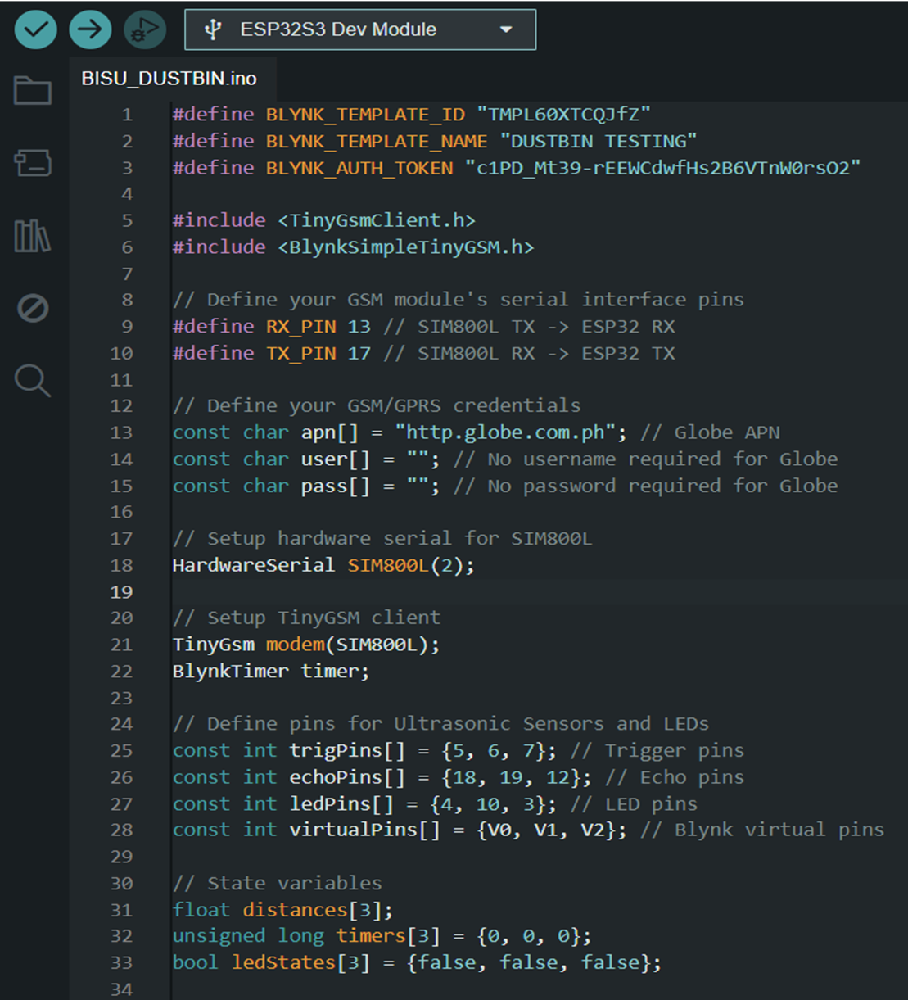
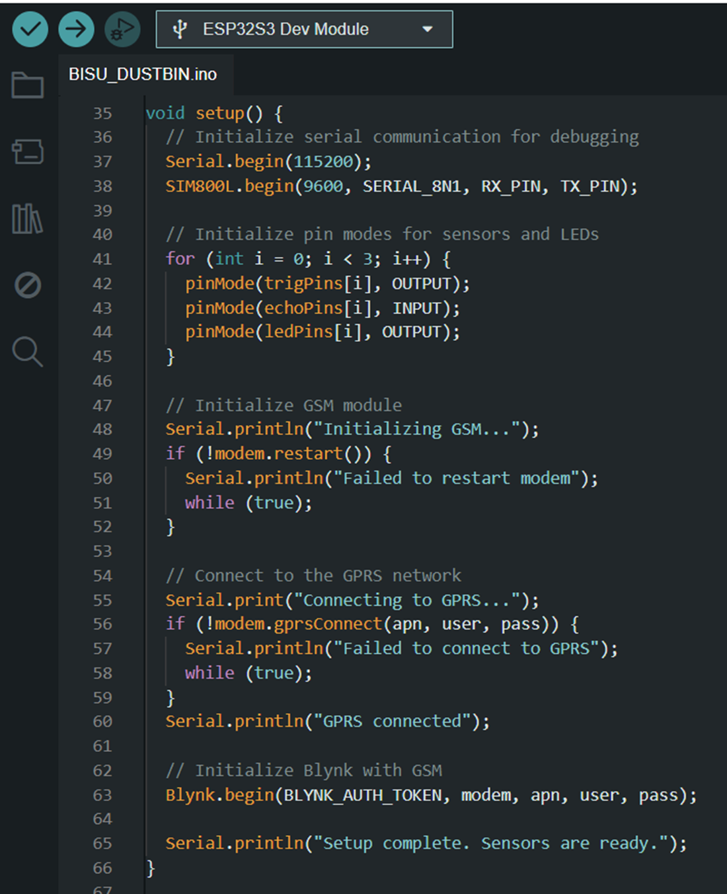
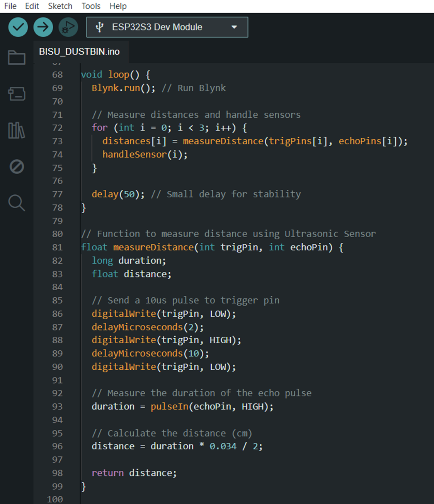
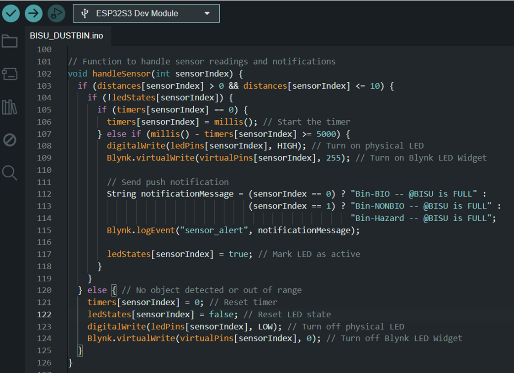
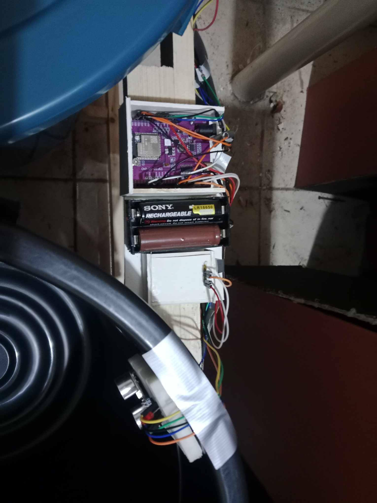
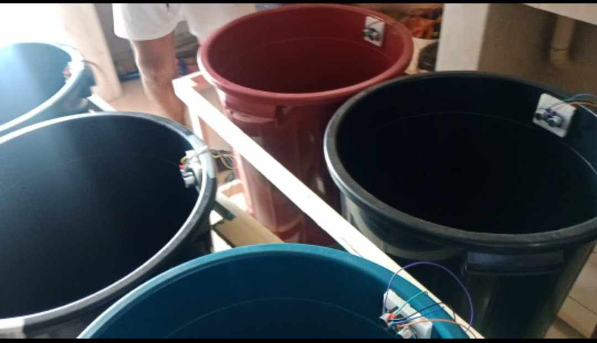

### EMBEDDED SYSTEM PROJECT

# REAL-TIME DUSTBIN EMPTYING ALERT SYSTEM

# Introduction

Effective waste management is a critical issue in both urban and rural areas. Overflowing dustbins not only create unsanitary conditions but also pose environmental and health risks. Traditional waste collection systems often rely on manual checks, leading to inefficiencies and delays.
The **Real-Time Dustbin Emptying Alert System** is designed to address these challenges by automating the process of monitoring dustbin levels. Using sensors and communication technologies, the system detects when dustbins are full and sends alerts to the relevant authorities, ensuring timely waste collection.

# Objectives

**Primary Objective:** To create a smart dustbin management system that improves waste collection efficiency by providing status updates.

# System Overview

The **Real-Time Dustbin Emptying Alert System** is a practical solution designed to improve waste management by providing real-time notifications about the status of categorized dustbins. The system consists of **two sets of three dustbins** for **BIO**, **NON-BIO**, and **HAZARD** waste, equipped with ultrasonic sensors for fill-level monitoring. When a bin becomes full, a push notification is sent via the **SIM800L GSM module** to the designated waste management personnel, ensuring timely collection.

# Key Features:
**•	Categorized Dustbins:** The system consists of two sets of three dustbins, specifically designated for **BIO, NON-BIO, and HAZARD** waste. These bins are equipped with ultrasonic sensors to continuously monitor the fill levels of the bins.

**•	Ultrasonic Sensors for Fill-Level Monitoring:** Each dustbin is equipped with ultrasonic sensors (one for each bin) that measure the distance from the side of the bin to the waste inside. When the distance is less than or equal to 10 cm (indicating the bin is full), the system triggers an alert.

**•	Real-Time Notifications:** When a bin becomes full, the system sends a push notification via the SIM800L GSM module to a designated phone. Simultaneously, the system updates the Blynk App with the status of the bin, displaying a visual indicator (widget) that shows whether the bin is full.

**•	Blynk App Integration:** The system uses the **Blynk App** to display a **real-time dashboard** for monitoring the status of each bin. The App is equipped with a **Widget** for each dustbin, where a color-coded visual (such as a green, red, and black indicator) will show the bin’s fill status. A red color indicates that the bin is full, and gray means the bin is still empty or has room for more waste.

# Hardware Components
| **Component**           | **Specifications**                               | **Quantity** | **Purpose**                                                                                      |
|--------------------------|--------------------------------------------------|--------------|--------------------------------------------------------------------------------------------------|
| ESP32-S3 Dev Module      | - Dual-core processor - GPIO pins             | 2            | Serves as the main controller for processing sensor data and communicating with the GSM module and Blynk. |
| SIM800L GSM Module       | - Operating Voltage: 3.7V–4.4V - Quad-band GSM| 2            | Serves as the main controller for processing sensor data and communicating with the GSM module and Blynk. |
| Ultrasonic Sensor        | - Voltage: 5V - Measuring Range: 2cm–400cm - Accuracy: ±3mm | 6 | Measures the distance of objects inside the bins.                                                |
| LEDs                     | - Voltage: 2.0V–3.2V - Current: 20mA         | 6            | Provides visual indication when a bin is full.                                                  |
| Power Supply for SIM800L | - Voltage: 3.7V–4.4V - Current: ≥2A           | 2            |                                                                                                  |
| Breadboard               | - Standard                                       | 2            | Used for prototyping and connecting all components.                                              |
| Jumper Wires             | - Male-to-male, male-to-female                  | 40+          | Connects components on the breadboard.                                                          |

**Software Components**
| **Libraries**                | **Purpose**                                                             |
|-------------------------------|-------------------------------------------------------------------------|
| TinyGSM                      | Communicates with the SIM800L GSM module.                               |
| Blynk                        | Integrates with the Blynk app for IoT control and monitoring.           |
| Arduino Core for ESP32 S3 UNO | Essential support for programming ESP32 boards.                        |

# System Design

## Flowchart

# Circuit Diagram

# Code Snippets

The system code for the setups at BISU and the Grandstand is identical, with the exception of the virtual pins configured for the Blynk App. At BISU, the system utilizes virtual pins V0, V1, and V2, while the Grandstand setup uses V3, V4, and V5.

# Output

